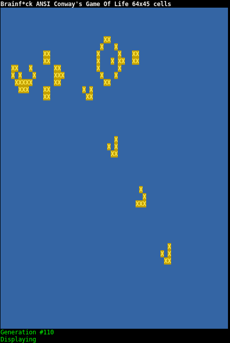

# Example : ANSI Conway's Game Of Life

You may compile by

    java -jar bf.jar -cdkv life.asm

You may run the program by

    cat GosperGliderGun.txt | java -jar bf.jar life.bf

or

    java -jar bf.jar -i GosperGliderGun.txt

Here below the famous Gosper Glider Gun at generation #110

       
