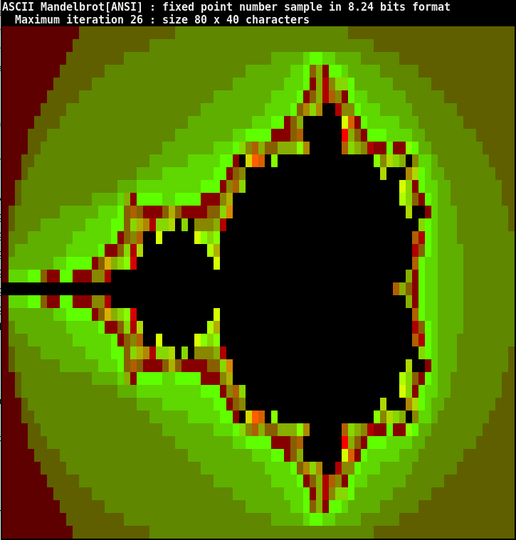

# Example : ASCII Mandelbrot - Fixed point value and computation

Compile and run the program by

     java -jar bf.jar mandel.asm

An ANSI color version by

    java -jar bf.jar mandelANSI.asm 
       
mandelANSI execution result:

       

typical usage is (non ANSI)

    [mandel]$ java -jar ../../bf.jar mandel.asm 
    Compilation Success
    3224964 characters code into 1050141 instructions
    ASCII Mandelbrot : fixed point number sample in 8.24 bits format
      Maximum iteration 26 : size 80 x 40 characters
    AAAAAAAAAAAABBBBBBBBBBBBBBBCCCCCCCCCCCCCCCCCCCCCCCCCCCBBBBBBBBBBBBBBBBBBBBBBBBBB
    AAAAAAAAAAABBBBBBBBBBBBCCCCCCCCCCCCCCCCCCCCCCCCCCCCCCCCCCCBBBBBBBBBBBBBBBBBBBBBB
    AAAAAAAAAABBBBBBBBBCCCCCCCCCCCCCCCCCCCCCCCDDDDDEFFEEDDDDCCCCCCBBBBBBBBBBBBBBBBBB
    AAAAAAAAABBBBBBBCCCCCCCCCCCCCCCCCCCCCCDDDDDDDEEFHJGFFEDDDDDCCCCCCBBBBBBBBBBBBBBB
    AAAAAAAABBBBBBCCCCCCCCCCCCCCCCCCCCCCDDDDDDDDEEEFGJMIKKFDDDDDDCCCCCCBBBBBBBBBBBBB
    AAAAAAABBBBBCCCCCCCCCCCCCCCCCCCCCDDDDDDDDDEEEEFGHJMNIGFEEDDDDDDCCCCCCBBBBBBBBBBB
    AAAAAABBBBCCCCCCCCCCCCCCCCCCCCCDDDDDDDDDDEEEEFHOKO  MIIFEEEDDDDDCCCCCCCBBBBBBBBB
    AAAAABBBBCCCCCCCCCCCCCCCCCCCCDDDDDDDDDDEEEFFGHJ      XTGFEEEEEDDDCCCCCCCBBBBBBBB
    AAAABBBCCCCCCCCCCCCCCCCCCCCDDDDDDDDDEEFFFFGGGHN      YJHGFFFEEEEDDCCCCCCCCBBBBBB
    AAAABBCCCCCCCCCCCCCCCCCCCDDDDDDDDEEEFKINJHHJJJLO     NKJIMGGFGGLFDDCCCCCCCCBBBBB
    AAABBCCCCCCCCCCCCCCCCCCDDDDDDEEEEEFFG WZT L               LIQKJ IEEDCCCCCCCCBBBB
    AAABCCCCCCCCCCCCCCCCCDDDDEEEEEEEEFFGHI                     Q   OQFEDDCCCCCCCCBBB
    AABCCCCCCCCCCCCCCCDDDEEEEEEEEEEFFFGINK                        XKGFEEDDCCCCCCCCBB
    AABCCCCCCCCCCCDDDDEJGFFFFEEFFFFGGGIP                          RKHGFEDDCCCCCCCCBB
    ABCCCCCCCDDDDDDEEEFHNHGGGHPHGGGGHHKU                           Q  GEDDDCCCCCCCCB
    ABCCCCDDDDDDDEEEEFFHKPOMKKQ K IIIJM                              KFEDDDCCCCCCCCB
    ACCCDDDDDDDEEEEEEFGHIN  X     XLKL                              NMFEDDDCCCCCCCCC
    ACDDDDDDDDEEEEEFGGHKMQ          RP                              MHFEDDDDCCCCCCCC
    ADDDDDDDEEFFFFGHVJKLS            X                              NFEEDDDDCCCCCCCC
    AEEEFFHGGFFGGGIIM                                              JGFEEDDDDCCCCCCCC
                                                                 NJHGFEEDDDDCCCCCCCC
    AEEEFFHGGFFGGGIIM                                              JGFEEDDDDCCCCCCCC
    ADDDDDDDEEFFFFGHVJKLS            X                              NFEEDDDDCCCCCCCC
    ACDDDDDDDDEEEEEFGGHKMQ          RP                              MHFEDDDDCCCCCCCC
    ACCCDDDDDDDEEEEEEFGHIN  X     XLKL                              NMFEDDDCCCCCCCCC
    ABCCCCDDDDDDDEEEEFFHKPOMKKQ K IIIJM                              KFEDDDCCCCCCCCB
    ABCCCCCCCDDDDDDEEEFHNHGGGHPHGGGGHHKU                           Q  GEDDDCCCCCCCCB
    AABCCCCCCCCCCCDDDDEJGFFFFEEFFFFGGGIP                          RKHGFEDDCCCCCCCCBB
    AABCCCCCCCCCCCCCCCDDDEEEEEEEEEEFFFGINK                        XKGFEEDDCCCCCCCCBB
    AAABCCCCCCCCCCCCCCCCCDDDDEEEEEEEEFFGHI                     Q   OQFEDDCCCCCCCCBBB
    AAABBCCCCCCCCCCCCCCCCCCDDDDDDEEEEEFFG WZT L               LIQKJ IEEDCCCCCCCCBBBB
    AAAABBCCCCCCCCCCCCCCCCCCCDDDDDDDDEEEFKINJHHJJJLO     NKJIMGGFGGLFDDCCCCCCCCBBBBB
    AAAABBBCCCCCCCCCCCCCCCCCCCCDDDDDDDDDEEFFFFGGGHN      YJHGFFFEEEEDDCCCCCCCCBBBBBB
    AAAAABBBBCCCCCCCCCCCCCCCCCCCCDDDDDDDDDDEEEFFGHJ      XTGFEEEEEDDDCCCCCCCBBBBBBBB
    AAAAAABBBBCCCCCCCCCCCCCCCCCCCCCDDDDDDDDDDEEEEFHOKO  MIIFEEEDDDDDCCCCCCCBBBBBBBBB
    AAAAAAABBBBBCCCCCCCCCCCCCCCCCCCCCDDDDDDDDDEEEEFGHJMNIGFEEDDDDDDCCCCCCBBBBBBBBBBB
    AAAAAAAABBBBBBCCCCCCCCCCCCCCCCCCCCCCDDDDDDDDEEEFGJMIKKFDDDDDDCCCCCCBBBBBBBBBBBBB
    AAAAAAAAABBBBBBBCCCCCCCCCCCCCCCCCCCCCCDDDDDDDEEFHJGFFEDDDDDCCCCCCBBBBBBBBBBBBBBB
    AAAAAAAAAABBBBBBBBBCCCCCCCCCCCCCCCCCCCCCCCDDDDDEFFEEDDDDCCCCCCBBBBBBBBBBBBBBBBBB
    AAAAAAAAAAABBBBBBBBBBBBCCCCCCCCCCCCCCCCCCCCCCCCCCCCCCCCCCCBBBBBBBBBBBBBBBBBBBBBB
         